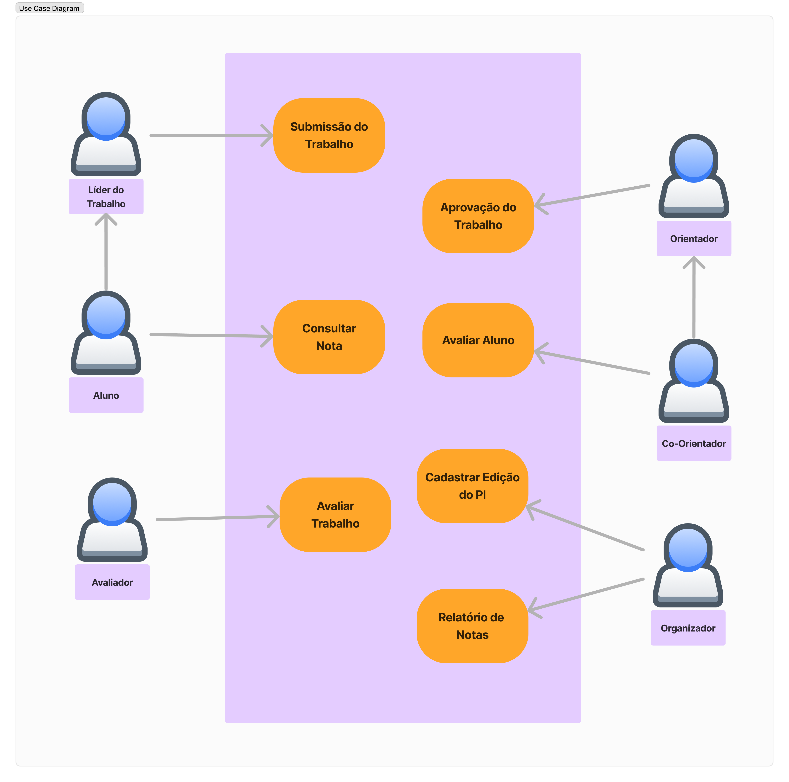

# Fabrica Painel backend.

## Diagrama do banco de dados.

## Populate: 

Script created to speed up the process of creating database registers. Used for testing purposes only.

```powershell
pdm run populate [models] [--locale] [--instances]
``` 

- Modes: Obligatory argument. If it's more than one model, it MUST be separated by space.
- Locale: Optional argument. Used to specify the localization to the generator. [Faker's Documentation](https://faker.readthedocs.io/en/stable/index.html#localization).
- Instances: Optional argument. Used to specify the number of created registers to the selected model(s).

Example 1:
```powershell
pdm run populate field
``` 
This command will create: 1 instance (the default can be changed) of the edition model, using brazilian portuguese localization (this default can also be changed).

Example 2:
```powershell
pdm run populate edition --locale it_IT,ja_JP --instances 5
``` 
This command will create: 5 instances of the edition model, using italian and japanese localization.


## Caso de uso do projeto.



## Fluxo do Lider do trabalho.

.png)

## Fluxo do Usuário

.png)


